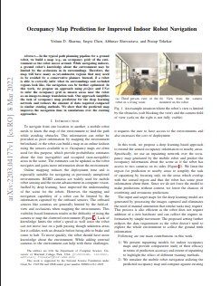

<strong>Point CLoud Prediction for Improved Inspection Planning</strong>

[Harnaik Dhami]([https://vishnuduttsharma.github.io/](http://raaslab.org/index.html)), [Vishnu Dutt Sharma](https://vishnuduttsharma.github.io/), [Pratap Tokekar](https://tokekar.com/) \\
[University of Maryland - College Park](https://umd.edu/)

  

 
<a href="https://arxiv.org/pdf/2203.04177.pdf">PDF</a>

  

 
<a href="https://github.com/VishnuDuttSharma/occupancy_prediction">Code</a>

									  

 

---

Citation

	@article{sharma2021risk,
	  title={Risk-Aware Path Planning for Ground Vehicles using Occluded Aerial Images},
	  author={Sharma, Vishnu Dutt and Tokekar, Pratap},
	  journal={arXiv preprint arXiv:2104.11709},
	  year={2021}
	}
