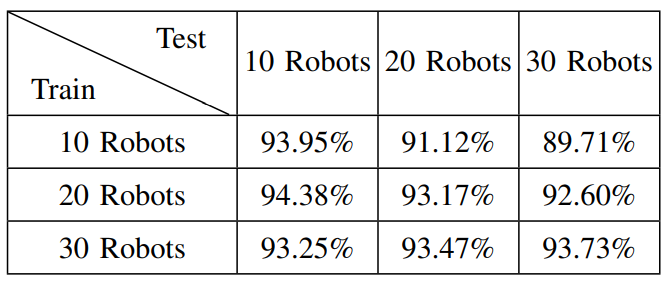

<strong>D2CoPlan: A Differentiable Decentralized Planner for Multi-Robot Coverage</strong>

[Vishnu Dutt Sharma](https://vishnuduttsharma.github.io/), [Lifeng Zhou](https://lfzhou917.github.io/), [Pratap Tokekar](https://tokekar.com/) \\
[University of Maryland - College Park](https://umd.edu/)

 

 
<a href="https://arxiv.org/pdf/2209.09292.pdf">PDF</a>

---

Abstract

Centralized approaches for multi-robot coverage planning problems suffer from the lack of scalability. Learning-based distributed algorithms provide a scalable avenue in addition to bringing data-oriented feature generation capabilities to the table, allowing integration with other learning-based approaches. To this end, we present a learning-based, differentiable distributed coverage planner (D2CoPlan) which scales efficiently in runtime and number of agents compared to the expert algorithm, and performs on par with the classical distributed algorithm. In addition, we show that D2CoPlan. can be seamlessly combined with other learning methods to learn end-to-end, resulting in a better solution than the individually trained modules, opening doors to further research for tasks that remain elusive with classical methods.

---

Method

D2CoPlan is planner network which takes the local coverage map as input and prescribes the best action for each robot in decentralized manner. We networks is desgined using a convolutional neural network (CNN), a graph neural network (GNN), and a multi-layer perceptron (MLP). Additionally, D2CoPlan can be combined seamlessly with a differentible map predictor (DMP), to help with complex task that are difficult to solve with classical approaches.

 

*Overview of our approach from a robot’s perspective: first the local observations are processed to generate the current coverage map. This can be done with the Differentiable Map Processor (DMP). D2CoPlan takes the coverage map as the input and processes it to first generate compact feature representation, with Map Encoder; shares the features with its neighbors, using the Distributed Feature Aggregator; and then selects an action using the aggregated information, with the Local Action Selector. The abbreviations in the parentheses for D2CoPlan’s sub-modules indicate the type of neural network used in their implementation. We train D2CoPlan using a centralized approach (referred to as Expert).*

---

Results

A good decentralized planner should have certain desirable properties. Since we use a neural network to build this planner, it should be shown to generalize well. We present these properties below and show that D2CoPlan encompasses these properties, making it a good alternative to the classical approach. W also show that the differentiablity of D2CoPlan allows it to be trained together with other network for others tasks, making it preferable over the classical counterpart. We provide comaprison over coverage for dynamic targets in this work as an exmaple.

Scalability Compared to the Centralized Approach

  
**Property**: A good decentralized planner should run faster than the centralized approach, while performing within a reasonable range of Expert. 

 

<i>Comparison of Expert, D2CoPlan, and Random in terms of running time (plotted in log scale) and the number of targets covered, averaged across 1000 Monte Carlo trials. D2CoPlan was trained on 20 robots. D2CoPlan is able to cover 92%-96% of the targets covered by Expert, while running at a much faster rate.</i>

Similarity with the Decentralized Approach

**Property**: A good decentralized planner based on neural network should perform similar to a classical decentralized approach.  

<i>Comparison of D2CoPlan, and DG in terms of running time (plotted in log scale) and the number of targets covered, averaged across 1000 Monte Carlo trials. D2CoPlan was trained on 20 robots. D2CoPlan is able to cover almost same number of targets as DG. DG is faster for fewer number of robots, but as the number of robots increase, D2CoPlan scales better than it.</i>
  

Generalizability of NN-based Approach

**Property**: A neural network-based decentralized planner should generalize well across varying number of robots and target density.  

 
 
Percentage of the targets covered averaged across 1000 trials) with respect to Expert by D2CoPlan trained and tested with varying numbers of robots.

   
   
Percentage of the targets covered (the average across 1000 trials) with respect to Expert by D2CoPlan across varying target density maps.

  

Integration with Differentiable Modules

  
**Property**: A differentiable decentralized planner should help other differetiable moduels for downstream tasks perform better. 

 
<i>
Comparison of coverage highlighting the effect of using D2CoPlan, a differentiable planner to aid learning for a differentiable map predictor (DMP), which works better than the DMP trained standalone.
</i> 

 
<i>
An ablation study for DMP and D2CoPlan. The plot shows results for the scenarios where there parts and trained together or in isolation. 
</i>

---

Citation

	@InProceedings{sharma2023d2coplan,
	  author    = {Vishnu {Dutt Sharma} and Lifeng Zhou and Pratap Tokekar},
	  booktitle = {IEEE International Conference on Robotics and Automation (ICRA)},
	  title     = {D2CoPlan: A Differentiable Decentralized Planner for Multi-Robot Coverage},
	  year      = {2023}
}
  
  
