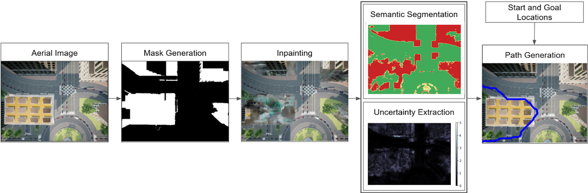

<strong>Risk-Aware Path Planning for Ground Vehicles using Occluded Aerial Images</strong>

[Vishnu Dutt Sharma](https://vishnuduttsharma.github.io/), [Pratap Tokekar](https://tokekar.com/) \\
[University of Maryland - College Park](https://umd.edu/)

Abstract

We consider scenarios where a ground vehicle plans its path using data gathered by an aerial vehicle. In the aerial images, navigable areas of the scene may be occluded due to obstacles. Naively planning paths using aerial images may result in longer paths as a conservative planner may try to avoid regions that are occluded. We propose a modular, deep learning-based framework that allows the robot to predict the existence of navigable areas in the occluded regions. Specifically, we use image inpainting methods to fill in parts of the areas that are potentially occluded, which can then be semantically segmented to determine navigability. We use supervised neural networks for both modules. However, these predictions may be incorrect. Therefore, we extract uncertainty in these predictions and use a risk-aware approach that takes these uncertainties into account for path planning. We compare modules in our approach with non-learning-based approaches to show the efficacy of the proposed framework through photo-realistic simulations. The modular pipeline allows further improvement in path planning and deployment in different settings.

---

Method

We propsose a planning framework consisting of an automated masking procedure, an image inpainting network to replace the masked region with underlying scene, and a risk-aware path planner to prescribe better, risk-aware paths through occluded, but potentially navigable areas for the ground robot using images from a UAV.

 

*Overview of the proposed framework. Given an aerial image, a mask is generated indicating the parts that need to
be modified. Using the mask, the image is inpainted, and then semantic segmentation and uncertainty map are generated. A
path-planner uses a combination of them to generate a risk-aware path*

---

Results

Various parts in our fraemwork provide better results than teh traditional approaches and allow the user to select risk-aware paths as per their risk appetite.

 

*Our masking procedure can perfrom similar to manual selction of potential areas for inpainitng and is completely automated.*

 

*The inpainting network perform better than the traditional, non-learning-based inpainting methods. While the resulting images may not look aesthetically pleasing due to limited data, they help well with path planning.*

*Comparison of paths predicted for various λs i.e. level of risk-aversion, for the image with occlusions and the inpainted image.*

*Surprise for various λs over original and inpainted images.*

---

Citation

	@article{sharma2022occupancy,
	  title={Occupancy Map Prediction for Improved Indoor Robot Navigation},
	  author={Sharma, Vishnu Dutt and Chen, Jingxi and Shrivastava, Abhinav and Tokekar, Pratap},
	  journal={arXiv preprint arXiv:2203.04177},
	  year={2022}
	}

