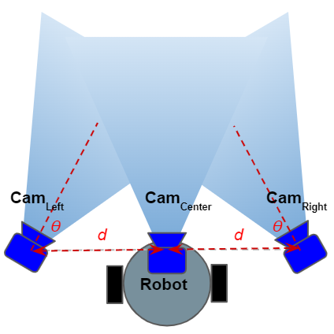
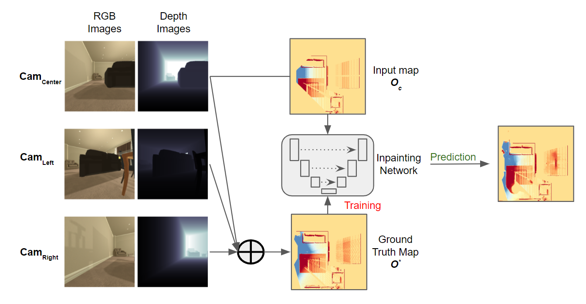
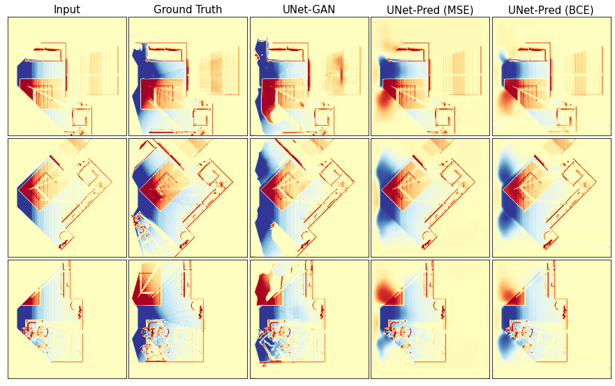

<strong>Occupancy Map Prediction for Improved Indoor Robot Navigation</strong>

[Vishnu Dutt Sharma](https://vishnuduttsharma.github.io/), [Jingxi Chen](https://codingrex.github.io/), [Abhinav Shrivastava](http://www.cs.umd.edu/~abhinav/), [Pratap Tokekar](https://tokekar.com/) \\
[University of Maryland - College Park](https://umd.edu/)

Abstract

In the typical path planning pipeline for a ground robot, we build a map (e.g., an occupancy grid) of the environment as the robot moves around. While navigating indoors, a ground robot's knowledge about the environment may be limited by the occlusions in its surroundings. Therefore, the map will have many as-yet-unknown regions that may need to be avoided by a conservative planner. Instead, if a robot is able to correctly infer what its surroundings and occluded regions look like, the navigation can be further optimized. In this work, we propose an approach using pix2pix and UNet to infer the occupancy grid in unseen areas near the robot as an image-to-image translation task. Our approach simplifies the task of occupancy map prediction for the deep learning network and reduces the amount of data required compared to similar existing methods. We show that the predicted map improves the navigation time in simulations over the existing approaches.

---

Method

We use UNet[1] and pix2pix[2] as inpainting networks, trained on an effeicent data collection strategy that emulated presence of additional cameras on the robot.

  

*Overview of the proposed approach. We take the input view from the left and right sides of the robot looking towards the region of interest. The inpainting network is trained by using the occupancy from the center camera only, and the combined map from the three cameras acts as the ground truth.*

---

Results

Pix2pix achieves a better performance than simple UNet, both qualitatively and quantitatively. Using the inpainting for occupancy map inpainting, the robot is able to naviagte more efficently using a single depth camera only.

 

*A few example predictions from the models used in our experiemnts*

<video width="33%" autoplay loop muted> <source src="../vids/projects/occmap_normal_video.mp4"> </video>  
<video width="33%" autoplay loop muted> <source src="../vids/projects/occmap_gt_video.mp4"> </video> 
<video width="33%" autoplay loop muted> <source src="../vids/projects/occmap_ganl_video.mp4"> </video> 

 
*The navigation results with (a) a single camera setup, (b) multi-camera camera setup, and (c) predicting/inpainting the occupancy map from the single camera feed. The inpainting augments the robot's infromation about the environment and helps it move faster.*

--- 

References

[1] Ronneberger, Olaf, Philipp Fischer, and Thomas Brox. "U-net: Convolutional networks for biomedical image segmentation." International Conference on Medical image computing and computer-assisted intervention. Springer, Cham, 2015.

[2] Isola, Phillip, et al. "Image-to-image translation with conditional adversarial networks." Proceedings of the IEEE conference on computer vision and pattern recognition. 2017.

---

Citation

	@article{sharma2021risk,
	  title={Risk-Aware Path Planning for Ground Vehicles using Occluded Aerial Images},
	  author={Sharma, Vishnu Dutt and Tokekar, Pratap},
	  journal={arXiv preprint arXiv:2104.11709},
	  year={2021}
	}

